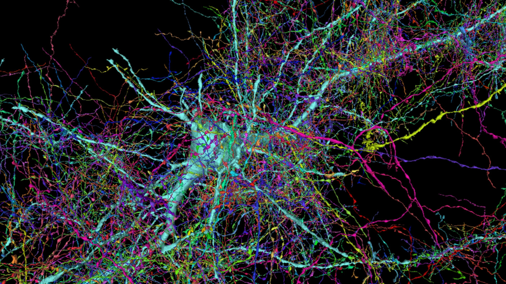

Welcome to the beginning of Scientia.

Scientia is a knowledge management platform that is developed to enable users to assemble knowledge networks from a variety of sources and media, relate ideas to one another and to quickly retrieve said information using simple inputs (text, a couple clicks, a slide of a handle, etc).

<!-- truncate -->

## Why scientia?

Scientia (Latin for Knowledge) was an idea that I had when I was applying to medical school (that never happened). I was having a chat with my flatmate who was a 5th year med student at the time, and they were discussing the annoyances they were observing in the medical system where specialists didn't share notes with one another. They were frustrated as they couldn't understand how as future doctors, they were getting trained to treat the human body as a system or series of relationships, yet the consultants were treating each part of the body in isolation. My flatmate was also studying for their 5th year exams at the time and they were constantly retrieving information from a variety of places and trying to cram this information into a series of diagrams, paragraphs, drawings etc, to make sure that they could remember it all for their exams.

The pain point that I wanted to solve was this:

*As a medical student, how could I configure a knowledge network in a way that is is easily queryable and usable, and have it designed in such a way that the relevant information gets brought to the top and I could find related information in an easy to use way that best suits me*.

Google comes to mind, but that is too broad. So does [Notion](https://www.notion.so/) and [Roam Research](https://roamresearch.com/). Roam probably comes the closest for the relational stuff and Google comes to mind for the relevancy stuff, but nothing finds the "Goldilocks zone" between the two.

The other problem that I wanted to solve was the problem of a *concept*.

## The trouble with concepts

A concept is *an abstract idea*. It could be a word. It could be a phrase. It could be a sound, a picture, a physical object, or it could be all of these things all at once. The tricky part about memory is that we all store details about the same concept *differently*. I remember something entirely differently to how you may remember the same thing. We also relate things to each other in our own unique ways.

Take, for example, the "concept" of a chocolate chip cookie :cookie: (I only use that as I am eating some as I write this):

Some of us may remember a recipe for chocolate chip cookies by their smell, others by the person who may them. Some of us remember them because of the products we use to make them ([Whittakers](https://www.whittakers.co.nz/en_NZ) Milk/Dark Chocolate 50:50 mix). Some of us attach a memory to eating them as children, and others picture the caramelly colour, or the texture of the crisp edges. My point is as follows:

The question I want to solve is the following:
*How do I allow a user to construct a knowledge graph that **best reflects** the concepts that are important to them, and relate them to one another in ways that they find best suits the way they think?*

## Mapping the "connectome" (not fully)

For those of you not familiar with the field of *Connectomics*, the human [Connectome](https://www.sciencedirect.com/topics/medicine-and-dentistry/connectome) *describes the comprehensive set of neuronal connections of a species' central nervous system.* Plaing english; the connectome is a bunch of connected cells that talk to one another. These cells are in the brain, spinal chord and throughout the body.

**HUGGGGEEEE** efforts have gone in to map this thing physically. The scale at which it operates is on the scale of atoms (if not smaller) and its complexity is something not to be triffled with.

So I will not be mapping the physical connectome of the brain. This would be moronic to think I could do so by myself when people **much brighter** than me have dedicated their careers and PhDs to this endeavour.

However, what I am attempting to do is to allow a user to map their knowledge network as it grows and evolves and to do so in an way that is intuitive and fast, and that allows for the user to access this information to inform future thought in an extremely friendly and efficient manner. The closest parallel I can think of is mapping the connectome.

I accept that each user's graph will never be complete, and that is okay. I wouldn't want it to be. That is one of the things about neuroplasticity that amazes me; our brains are continually evolving and changing to our experiences, our environments, our feelings, our desires and our thoughts. This flexibility and adaptibility is what I want to build into Scientia.

So come along for the ride as I try to build this thing. I will be documenting the process as I go, so sit down, buckle up and enjoy the f**king show.

