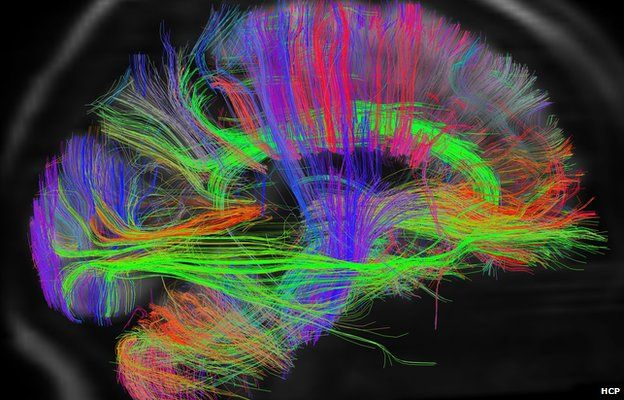

Scientia is a complex application. It represents networked data in a way that has multiple methods of classification and heirarchization.
The desire with Scientia is to enable users to interact with their knowledge how *their* brain works and by extension how their connectome is structured, and so why not take inspiration from the connectome itself.

<!--truncate-->

## What is the Connectome?

[credit](https://www.psychologytoday.com/intl/blog/the-athletes-way/201311/what-is-the-human-connectome-project-why-should-you-care)

The Connectome describes the comprehensive set of neuronal connections of a species' central nervous system. In a nutshell, it represents how our brain cells are connected to one another.

## Knowledge as a Graph

Knowledge graphs are not a new concept. First coined by Austrain Linguist Edgar W. Schneider in 1972, a *knowledge graph* is a knowledge base that uses a graph-structured data model or topology to represent and operate on data. Knowledge graphs are often used to store interlinked descriptions of entities - objects, events, situations, or abstract concepts - while also encoding the semantics or relationships underlying these entities.

## Key Terms

There are some key terms that will be used throughout Scientia, and so these will be defined here.

### Axon

In neurobiology, an axon or nerve fiber, is a long, slender projection of a nerve cell, or neuron, in vertebrates, that typically conducts electrical impulses known as action potentials away from the nerve cell body.
In Scientia, an Axon is the "connector" that joins two Neurons together. This is the "messenger" data type within Scientia and allows us to represent [concepts](#concept), [topics](#topic), and [thought streams](#though-stream) as interconnected elements.

### Centrality

Centrality is typically used in graph theory to find nodes in the graph that have a certain degree of weight or influence based on a given heuristic.

#### Degree Centrality

*Degree Centrality* counts the number of incoming and outgoing relationships from a node, and is used to find popular nodes in a graph.

#### Closeness Centrality

*Closeness Centrality* is a way of detecting nodes that are able to spread information efficiently throughout a subgraph. Essentially, can a given node quickly access all the other nodes in the subgraph. It can be used for evaluating the importance of words in a document, for example.

#### Betweenness Centrality

*Betweenness Centrality* is a way of detecting the amount of influence a node has over the flow of information or resources in a graph. It can be used for finding choke points or important items in the graph.

#### Page Rank

Page rank 

### Concept

A concept is *something conceived in the mind* and is said to be a collection of things *organised around a main idea or theme*.

In Scientia, a *Concept* is a collection of [Nuclei](#nucleus) and [Axons](#axon). It can be treated as a [graph](#graph) in and of itself, and is queryable. A concept could be cyclic, in that it is a throught-stream where the start position is the same as an end position. It could also follow a hub-and-spoke model, where there is a central Nucleus with other nuclei attached to it. This would be a nucleus with a high degree of [centrality](#centrality).

### Definition

### Graph

### Myelin

In neurobiology, Myelin is a lipid-rich material that surrounds nerve cell axons (the nervous system's electrical wires) to insulate them and increase the rate at which electrical impulses (called action potentials) pass along the axon.

In Scientia, Myelin is the strength of a given axon and determines the weight that it has in a given [graph](#graph), [topic](#topic), or [concept](#concept). It is always associated with an [axon](#axon) and has methods that allow for the increment and decrement of its strength.

### Nerve

### Nucleus

In neurobiological terms, the Nucleus of a neuron is an oval shaped membrane-bound structure found in the soma or body of the neuron.
In Scientia, a Neuron is the smallest building block. It has a Defintion and optionally, other associated content (depending on the type of media). This associated content could be text, an 3D model, a video, a picture, or something else. I am still in the process of choosing the media that Neurons can be presented with (and for version one, it will probably be just images).

### Though Stream

### Topic
